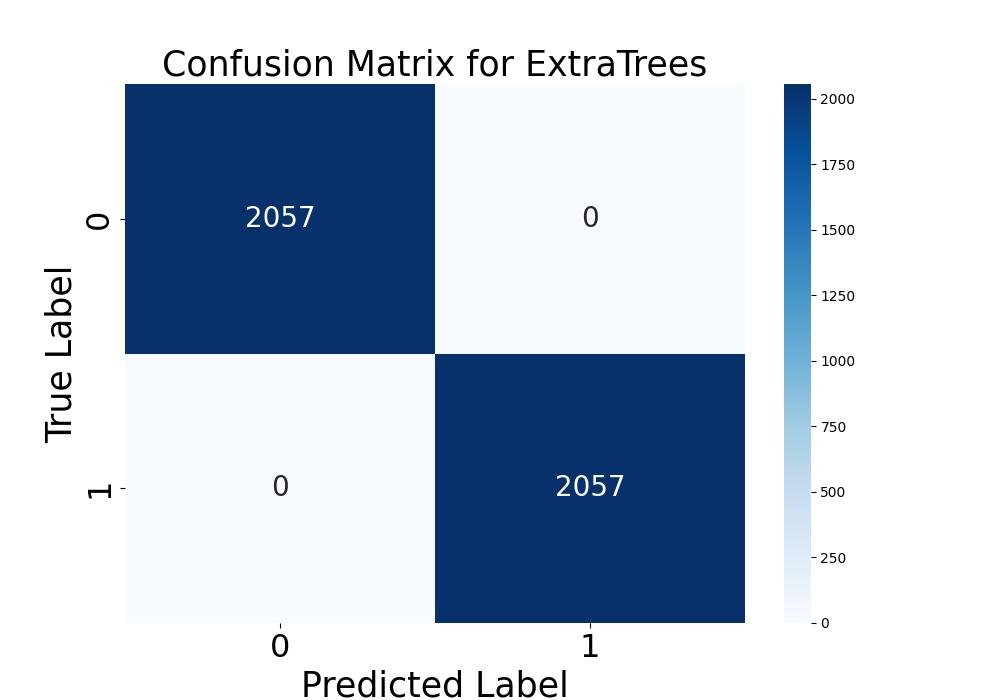
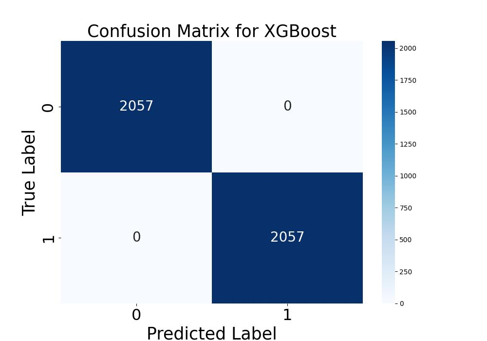

# This is the code for the paper 'Machine Learning Based Real-Time Detection of Bearing Faults in Induction Motors'

## Project overview
Edge‑ready condition monitoring system for three‑phase induction motors combining low‑cost current sensing, real‑time feature extraction and supervised machine‑learning models. The framework detects outer‑race bearing faults within one second of onset and visualises the motor’s health through a lightweight GUI.

## Code structure
* `feature_extraction.py` – offline generation of time‑, frequency‑ and wavelet‑domain features from raw current signals.
* `main.py` – trains Decision Tree, Random Forest, Extra Trees, HistGradientBoost and XGBoost, saves metrics, confusion matrices, ROC and PR curves.
* `MLinference.py` – SPI acquisition loop on Raspberry Pi 5, rolling‑window feature extraction and live classification.
* Jupyter notebooks – interactive exploration (optional).

## Dataflow
1. **Acquisition** – 10 kHz three‑phase stator currents via USM‑31V board → MCP3008 ADC → Raspberry Pi 5.
2. **Pre‑processing** – de‑offset, outlier removal, min–max scaling.
3. **Feature extraction** – statistical moments, FFT magnitudes, db6 DWT coefficients, cross‑phase products.
4. **Model training & evaluation** – grid‑search optional, 5‑fold stratified CV.
5. **Deployment** – best model serialized for `MLinference.py`; GUI displays raw, FFT, DWT and predicted fault status.

## Results

| Model | Accuracy | Precision | F1 |
| --- | --- | --- | --- |
| Decision Tree | 0.991 | 0.991 | 0.991 |
| Random Forest | 0.995 | 0.995 | 0.995 |
| Extra Trees | 0.993 | 0.993 | 0.993 |
| XGBoost | 0.999 | 0.999 | 0.999 |
| HistGradientBoost | 0.998 | 0.998 | 0.998 |

Random Forest offered the best latency‑to‑accuracy trade‑off during live tests, whereas XGBoost reached the highest offline accuracy.

### Confusion matrices




## Inputs and outputs
* **Input** – `enhanced_dataset.csv` (features + label).  
* **Outputs** – metrics CSV, curves in `results/`, trained models in `Models/pkl/`.

## Quick start
```bash
pip install -r requirements.txt
python main.py              # training & evaluation
python MLinference.py       # real‑time monitoring on Raspberry Pi
```

## Citation
Soon to be published
